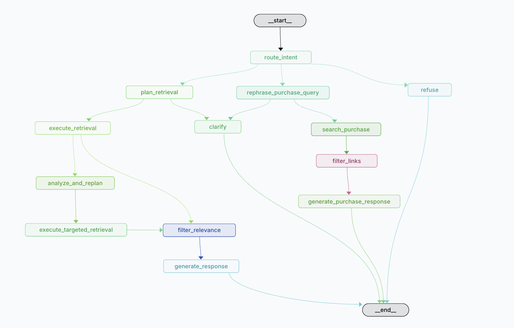

# Agentic Supplement Advisor


An AI-powered vitamin and supplement advisor that combines RAG over a general knowledge base with personal health data analysis. Users can ask health questions, upload personal documents (lab results, prescriptions), and search for purchase links — all routed through an intent-classifying agent pipeline.

Built with FastAPI, LangGraph, Streamlit, and ChromaDB.

## Features

- **Supplement Q&A with citations** — ask any vitamin or supplement question, get answers grounded in source documents
- **Personal health analysis** — upload lab results and get personalized insights based on your actual levels
- **Retrieval planning** — the agent plans which knowledge bases to query and in what order, adapting its search strategy to each question
- **Purchase links** — location-aware supplement shopping suggestions (powered by Tavily)
- **Knowledge gap awareness** — honestly tells you when information is missing instead of guessing, and suggests what to upload
- **Conversation memory** — multi-turn chat that remembers context across messages and sessions
- **Automatic document classification** — uploaded files are routed to the right knowledge base (general or personal) automatically

## Tech Stack

- **Backend:** Python, FastAPI
- **Agent orchestration:** LangGraph (StateGraph with conditional routing)
- **UI:** Streamlit
- **Vector store:** ChromaDB (separate general and per-user personal collections)
- **LLM:** OpenAI (configurable model via `LLM_MODEL` env var)
- **Web search:** Tavily (purchase links only — never used for medical evidence)
- **Tracing:** LangSmith (optional)

## Quick Start

### 1. Clone and install

```bash
git clone <repo-url>
cd agentic_supplement_advisor
python -m venv .venv
source .venv/bin/activate
pip install -e ".[dev]"
```

### 2. Configure environment

```bash
cp .env.example .env
```

Edit `.env` and add your API keys:

```
OPENAI_API_KEY=sk-...
TAVILY_API_KEY=tvly-...
```

### 3. Seed the general knowledge base

```bash
python -m scripts.seed_kb --general-only
```

### 4. Start the application

```bash
# Terminal 1 — API server
uvicorn app.main:app --reload --port 8000

# Terminal 2 — Streamlit UI
streamlit run ui/streamlit_app.py
```

Then open http://localhost:8501 in your browser.

## Architecture

### Graph Visualization



*Agent graph as visualized in LangSmith*

### Intent Classification

Every user message is classified into one of five intents:

- **health_general** — general vitamin/supplement questions (e.g., "What are the benefits of Vitamin D?")
- **health_personal** — questions about the user's own health data (e.g., "What do my lab results show?")
- **health_combined** — questions needing both personal data and general knowledge (e.g., "Given my low Vitamin D, what supplements should I take?")
- **purchase** — buying/pricing queries (e.g., "Where can I buy Vitamin C?")
- **out_of_scope** — anything unrelated to health/supplements

The intent always reflects what the user asked for, not what data is available. Data availability is handled downstream by knowledge gap detection.

### RAG Pipeline (Health Intents)

All three health intents share a common pipeline:

```
route_intent → plan_retrieval → execute_retrieval → filter_relevance → generate_response
```

1. **Plan retrieval** — a single LLM call creates 1-3 targeted search queries, each assigned to a specific collection (`general` or `personal`). The planner understands the classified intent and only queries the appropriate collection(s). For genuinely vague messages it returns a clarification question instead.

2. **Execute retrieval** — runs each planned query against its assigned ChromaDB collection. Results are merged and deduplicated by chunk ID.

3. **Filter relevance** — strict LLM-based KEEP/DROP per chunk. Only keeps chunks that directly address the specific topic (a chunk about Iron is dropped if the question is about Selenium). After filtering, runs knowledge gap detection to determine if the surviving chunks are sufficient.

4. **Generate response** — produces a cited answer based on three cases:
   - Sufficient info: full answer with inline citations
   - Partial info: answer what's possible, note the gap, suggest uploading more documents
   - No info: skip LLM, return a message directing the user to upload relevant documents

Citations are renumbered sequentially so the `[N]` references in the response text always match the Sources list exactly.

### Two-Phase Retrieval (HEALTH_COMBINED)

Combined queries get two additional nodes between execute_retrieval and filter_relevance:

```
plan_retrieval → execute_retrieval → analyze_and_replan → execute_targeted_retrieval → filter_relevance → generate_response
```

1. **Phase 1** — the planner creates personal-only queries. Execute retrieval fetches the user's lab results, prescriptions, or health records.

2. **Analyze and replan** — an LLM reads the personal chunks and extracts specific abnormal findings (e.g., "Vitamin D: 14 ng/mL (LOW)"). It then creates one targeted general KB query per finding (e.g., "Vitamin D supplementation dosage deficiency treatment"). If multiple deficiencies are found, an additional interaction query is added.

3. **Execute targeted retrieval** — runs the targeted general queries and merges the results with the existing personal chunks from phase 1.

This means the general knowledge retrieval is informed by what was actually found in the user's personal data, rather than guessing from the question text alone.

### Purchase Flow

```
rephrase_purchase_query → search_purchase (Tavily) → filter_links → generate_purchase_response
```

Includes location awareness — asks for city and country to avoid ambiguous results, persists location across conversation turns. Pronoun resolution ensures "where can I buy it?" after discussing Vitamin C becomes a search for Vitamin C specifically.

### Upload Flow

```
extract → chunk → classify → ingest
```

Documents are automatically classified as general or personal. Ambiguous documents are returned to the UI for the user to confirm.

## Project Structure

```
app/
├── main.py                  # FastAPI endpoints (/chat, /upload, /documents, /conversations)
├── config.py                # Pydantic Settings (.env)
├── agents/
│   ├── router.py            # Intent & document classification (LLM)
│   ├── nodes.py             # LangGraph node functions (plan, retrieve, filter, generate)
│   ├── chat_graph.py        # Chat agent StateGraph wiring (13 nodes)
│   └── upload_graph.py      # Upload/ingest StateGraph
├── models/
│   └── schemas.py           # Pydantic request/response models
├── services/
│   ├── document.py          # PDF/TXT extraction & chunking
│   ├── vectorstore.py       # ChromaDB wrapper (general + personal KB)
│   └── tavily_client.py     # Purchase link search (Tavily)
└── utils/
    └── citations.py         # Citation formatting

ui/
└── streamlit_app.py         # Streamlit frontend

data/
└── seed_documents/
    ├── general/             # .txt/.pdf files for shared knowledge base
    └── personal/            # .txt/.pdf files for personal KB seeding

scripts/
├── seed_kb.py               # Seed knowledge base from data/seed_documents/
└── clear_kb.py              # Clear vector store collections

tests/
├── test_documents.py        # Document extraction & chunking
├── test_routing.py          # Intent & document classification (mocked LLM)
├── test_vectorstore.py      # ChromaDB operations & data isolation
└── test_e2e.py              # End-to-end graph flow tests
```

## Configuration

All configuration is via environment variables (or `.env` file):

| Variable | Required | Description |
|----------|----------|-------------|
| `OPENAI_API_KEY` | Yes | OpenAI API key for LLM calls |
| `TAVILY_API_KEY` | Yes | Tavily API key for purchase link search |
| `LLM_MODEL` | No | OpenAI model name (default: `gpt-4o-mini`) |
| `CHROMA_PERSIST_DIR` | No | ChromaDB storage path (default: `./data/chroma`) |
| `LANGSMITH_TRACING` | No | Enable LangSmith tracing (`true`/`false`) |
| `LANGSMITH_API_KEY` | No | LangSmith API key |
| `LANGSMITH_PROJECT` | No | LangSmith project name (default: `supplement-advisor`) |

## Scripts

**Seed the knowledge base:**

```bash
python -m scripts.seed_kb                                 # ingest both folders
python -m scripts.seed_kb --clear                         # wipe + re-ingest all
python -m scripts.seed_kb --force                         # re-ingest without wiping
python -m scripts.seed_kb --general-only                  # general folder only
python -m scripts.seed_kb --personal-only --user-id alice # personal folder for user "alice"
```

**Clear collections:**

```bash
python -m scripts.clear_kb --general                          # clear general KB
python -m scripts.clear_kb --personal --user-id default_user  # clear a user's personal KB
python -m scripts.clear_kb --all                              # clear everything
```

## Testing

```bash
python -m pytest tests/ -v
```

All 47 tests run without API keys — LLM calls are fully mocked.

## API Endpoints

| Method | Path | Description |
|--------|------|-------------|
| `GET` | `/health` | Health check |
| `POST` | `/chat` | Chat with the advisor |
| `POST` | `/upload` | Upload a document (PDF/TXT) |
| `POST` | `/upload/confirm` | Confirm ambiguous document classification |
| `GET` | `/documents/preview/{doc_id}` | Preview document text |
| `GET` | `/documents/general` | List general knowledge documents |
| `GET` | `/documents/{user_id}` | List user's personal documents |
| `DELETE` | `/documents/{user_id}/{doc_id}` | Delete a personal document |
| `GET` | `/conversations/{user_id}` | List user's conversations |
| `DELETE` | `/conversations/{user_id}/{id}` | Delete a conversation |
| `GET` | `/conversations/{user_id}/{id}/messages` | Get conversation messages |

## Key Design Decisions

- **Dual knowledge base:** General KB is shared across all users; personal KB uses per-user ChromaDB collections with strict isolation
- **Two-phase combined retrieval:** For combined queries, personal data is read first and used to create targeted general queries per deficiency — the system retrieves general knowledge based on what the user actually has, not what the question implies
- **Tavily is purchase-only:** Never used for medical evidence — all health answers come from the vector store
- **Intent reflects user intent:** The classifier reports what the user asked for, not what data exists. Knowledge gap detection handles missing data gracefully
- **Strict relevance filtering:** Chunks must directly address the specific topic asked about. Being about supplements in general is not enough
- **Graceful fallbacks:** LLM failures default to safe classifications; Tavily failures return empty results; JSON parse failures fall back to single-query retrieval
- **No medical diagnoses:** System prompts explicitly forbid diagnostic claims and recommend consulting healthcare providers
